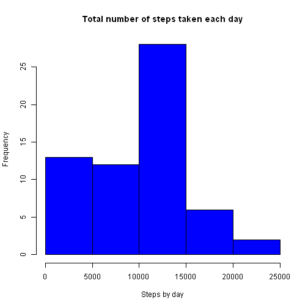
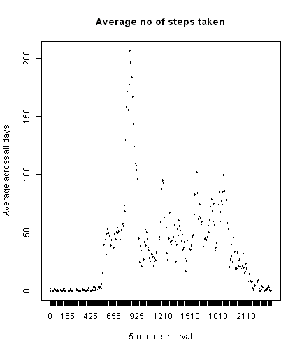
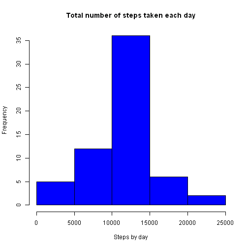
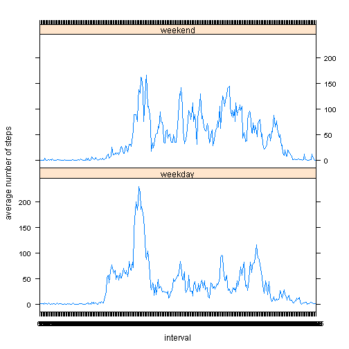

## Introduction

Title: "Reproducible Research: Peer Assessment 1"
Author: "Mbaye Kebe"
Date: "Friday, August 15, 2014"

It is now possible to collect a large amount of data about personal movement using activity monitoring devices such as a Fitbit, Nike Fuelband, or Jawbone Up. These type of devices are part of the "quantified self" movement - a group of enthusiasts who take measurements about themselves regularly to improve their health, to find patterns in their behavior, or because they are tech geeks. But these data remain under-utilized both because the raw data are hard to obtain and there is a lack of statistical methods and software for processing and interpreting the data.

This assignment makes use of data from a personal activity monitoring device. This device collects data at 5 minute intervals through out the day. The data consists of two months of data from an anonymous individual collected during the months of October and November, 2012 and include the number of steps taken in 5 minute intervals each day.

### Loading and preprocessing the data

Show any code that is needed to

1. Load the data (i.e. read.csv)
2. Process/transform the data (if necessary) into a format suitable for your analysis

```r
activity <- read.csv("activity.csv")
# change interval into factor
activity$interval <- factor(activity$interval)
```
### What is mean total number of steps taken per day?

For this part of the assignment, you can ignore the missing values in the dataset.

1. Make a histogram of the total number of steps taken each day

```r
# First get the data with total number of steps by day in a data frame called totalstepsby day and check
totalstepsbyday <- aggregate(activity$steps, by=list(activity$date), FUN=sum, na.rm=T)
head(totalstepsbyday, 5)
```

```
##      Group.1     x
## 1 2012-10-01     0
## 2 2012-10-02   126
## 3 2012-10-03 11352
## 4 2012-10-04 12116
## 5 2012-10-05 13294
```

```r
# We now plot the histogram of variable x, which is the second column in totalstepsbyday
hist(totalstepsbyday$x, main = "Total number of steps taken each day", xlab="Steps by day", col="blue")
```

 
2. Calculate and report the mean and median total number of steps taken per day

```r
# We can use the summary() function
summary(totalstepsbyday)
```

```
##        Group.1         x        
##  2012-10-01: 1   Min.   :    0  
##  2012-10-02: 1   1st Qu.: 6778  
##  2012-10-03: 1   Median :10395  
##  2012-10-04: 1   Mean   : 9354  
##  2012-10-05: 1   3rd Qu.:12811  
##  2012-10-06: 1   Max.   :21194  
##  (Other)   :55
```
### What is the average daily activity pattern?

1. Make a time series plot (i.e. type = "l") of the 5-minute interval (x-axis) and the average number
of steps taken, averaged across all days (y-axis)

```r
# We first generate the avstepsbyinterval data frame that contains the averages
avstepsbyinterval <- aggregate(activity$steps, by=list(activity$interval), FUN=mean, na.rm=T)
# Check first 4 records
head(avstepsbyinterval)
```

```
##   Group.1       x
## 1       0 1.71698
## 2       5 0.33962
## 3      10 0.13208
## 4      15 0.15094
## 5      20 0.07547
## 6      25 2.09434
```

```r
names(avstepsbyinterval) <- c("Interval", "Averagesteps")
# We then plot
plot(avstepsbyinterval$Interval, avstepsbyinterval$Averagesteps, type="l", xlab="5-minute interval",ylab="Average across all days", main="Average no of steps taken", col="blue")
```

 


2. Which 5-minute interval, on average across all the days in the data set , contains
the maximum number of steps?

```r
# We do it in 2 steps 
maxVal <- max(avstepsbyinterval$Averagesteps)
subset(avstepsbyinterval, avstepsbyinterval$Averagesteps == maxVal)[[1]]
```

```
## [1] 835
## 288 Levels: 0 5 10 15 20 25 30 35 40 45 50 55 100 105 110 115 120 ... 2355
```


### Imputing missing values

1. Calculate and report the number of missing values in the dataset
(i.e. the total number of rows with NAS)


```r
#We do
nbmissing <- sum(is.na(activity))
print(nbmissing)
```

```
## [1] 2304
```

2. Devise a strategy for filling in all missing values
We will just use the mean of the 5-minute interval for that day.

3. Create a new data set that is equal to the original but 
with the missing data filled in.


```r
#We first cbind activity with avstepsbyinterval in a new data frame
actaver <- cbind(activity, avstepsbyinterval)
#The first records will look this
head(actaver,5)
```

```
##   steps       date interval Interval Averagesteps
## 1    NA 2012-10-01        0        0      1.71698
## 2    NA 2012-10-01        5        5      0.33962
## 3    NA 2012-10-01       10       10      0.13208
## 4    NA 2012-10-01       15       15      0.15094
## 5    NA 2012-10-01       20       20      0.07547
```

```r
#So now we step through the dataset and replace NA with the average from column 5
for (i in 1:nrow(actaver)) {
  if (is.na(actaver[i,1])) actaver[i,1]<- actaver[i,5]
}
# We check the first 5 records of actaver
head(actaver,5)
```

```
##     steps       date interval Interval Averagesteps
## 1 1.71698 2012-10-01        0        0      1.71698
## 2 0.33962 2012-10-01        5        5      0.33962
## 3 0.13208 2012-10-01       10       10      0.13208
## 4 0.15094 2012-10-01       15       15      0.15094
## 5 0.07547 2012-10-01       20       20      0.07547
```

```r
#We remove the last two columns to get the final dataset
finalds <- actaver[,c(-4,-5)]
# Check
head(finalds,5)
```

```
##     steps       date interval
## 1 1.71698 2012-10-01        0
## 2 0.33962 2012-10-01        5
## 3 0.13208 2012-10-01       10
## 4 0.15094 2012-10-01       15
## 5 0.07547 2012-10-01       20
```

4. Make a histogram total number of steps taken each day and calculate and report
the mean and median total number of steps taken per day. 


```r
# a. First get the data with total number of steps by day in a data frame called totalstepsby day
totalstepsbydaynona <- aggregate(finalds$steps, by=list(finalds$date), FUN=sum, na.rm=T)
names(totalstepsbydaynona) <- c("Date", "Steps")
# b. then plot the histogram
hist(totalstepsbydaynona$Steps, main = "Total number of steps taken each day", xlab="Steps by day", col="blue")
```

 

```r
# b. Report the mean and median
summary(totalstepsbydaynona)
```

```
##          Date        Steps      
##  2012-10-01: 1   Min.   :   41  
##  2012-10-02: 1   1st Qu.: 9819  
##  2012-10-03: 1   Median :10766  
##  2012-10-04: 1   Mean   :10766  
##  2012-10-05: 1   3rd Qu.:12811  
##  2012-10-06: 1   Max.   :21194  
##  (Other)   :55
```

Do these values differ from from the estimates from the first part of the assignment?
What is the impact of imputing missiong data on the estimates? 
Yes the estimates differ somehow.
The mean of total number of steps taken per day has slightly increased
while the median has stayed the same.


### Are there differences in the activity patterns between weekdays and weekends?

1. Create a new factor variable in the dataset with two levels - "weekdays"
and "weekend" indicating whether a given date is a weekday or weekend day


```r
# We create first a new variable showing days of the week in the data set finalds
finalds$day <- weekdays(as.Date(finalds$date))
# We check first 4 records
head(finalds,4)
```

```
##    steps       date interval    day
## 1 1.7170 2012-10-01        0 Monday
## 2 0.3396 2012-10-01        5 Monday
## 3 0.1321 2012-10-01       10 Monday
## 4 0.1509 2012-10-01       15 Monday
```

```r
# We then create the factor variable with the two levels
for (i in 1:nrow(finalds)) {
  if (finalds$day[i] == "Saturday" | finalds$day[i] == "Sunday") {finalds$wkdayend[i] <- "weekend"
} else {
    finalds$wkdayend[i] <- "weekday"
}}
```

2. Make a panel  plot containing a time series plot (i.e. type="l")
of the 5-minute interval (x-axis) and the average number of steps taken 
averaged over across all weekdays or weekend days (y-axis).


```r
#We create a corresponding data set with the averages by 5-min interval and by
# weekdays/weekends
avstepsbyintervalbywkdayend <- aggregate(finalds$steps, by=list(finalds$interval,finalds$wkdayend), FUN=mean) 
# Check first 5 records
head(avstepsbyintervalbywkdayend,5)
```

```
##   Group.1 Group.2       x
## 1       0 weekday 2.25115
## 2       5 weekday 0.44528
## 3      10 weekday 0.17317
## 4      15 weekday 0.19790
## 5      20 weekday 0.09895
```

```r
# We can then rename the variables for convenience
names(avstepsbyintervalbywkdayend) <- c("interval", "dayfactorlevel", "averagesteps")
# We load lattice library
library(lattice)
# We then plot
xyplot(averagesteps ~ interval | dayfactorlevel, avstepsbyintervalbywkdayend, type="l", layout=c(1,2), xlab="interval", ylab="average number of steps")
```

 

There are differences in activity patterns between weekdays and weekends.


